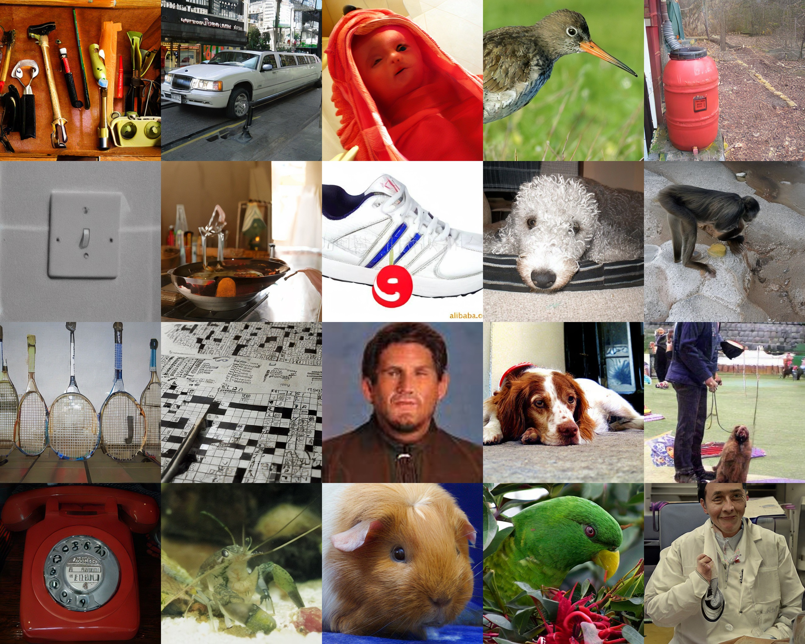

# DDO: A Universal Supercharger for Visual Diffusion/Autoregressive Models 🚀 SOTA on ImageNet

<div align="center">

[](https://arxiv.org/abs/2503.01103)&nbsp;
[](https://huggingface.co/nvidia/DirectDiscriminativeOptimization)&nbsp;
[](https://paperswithcode.com/sota/image-generation-on-cifar-10?p=direct-discriminative-optimization-your-1)&nbsp;
[](https://paperswithcode.com/sota/image-generation-on-imagenet-64x64?p=direct-discriminative-optimization-your-1)&nbsp;
[](https://paperswithcode.com/sota/image-generation-on-imagenet-256x256?p=direct-discriminative-optimization-your-1)&nbsp;
[](https://paperswithcode.com/sota/image-generation-on-imagenet-512x512?p=direct-discriminative-optimization-your-1)&nbsp;

</div>
<p align="center" style="font-size: larger;">
  <a href="https://arxiv.org/abs/2503.01103">Direct Discriminative Optimization: Your Likelihood-Based Visual Generative Model is Secretly a GAN Discriminator</a>
</p>

<div>
  <p align="center" style="font-size: larger;">
    <strong>ICML 2025 Spotlight</strong>
  </p>
</div>

<p align="center">

  <p align="center">
    <b>FID=1.26</b> on ImageNet 512x512, <i>without any guidance</i>.
  </p>
<p>


## Introduction

**Direct Discriminative Optimization (DDO)** enables **GAN-style finetuning** of likelihood-based generative models, such as **diffusion and autoregressive** models, without requiring an explicit discriminator network. By incorporating **reverse KL divergence** and **self-generated negative samples**—similar in spirit to **reinforcement learning methods used in large language models**—DDO overcomes the limitations of traditional **maximum likelihood training**, which relies on **forward KL** and often leads to **mode-covering behavior**. As a result, DDO can **substantially improve the generation quality without changing the network architecture or inference protocol**.

## Available Models
We release our finetuned checkpoints in [nvidia/DirectDiscriminativeOptimization · Hugging Face](https://huggingface.co/nvidia/DirectDiscriminativeOptimization).

| Model Files                                             | Base Repository                                             |
|---------------------------------------------------------|-------------------------------------------------------------|
| `edm-cifar10-uncond-vp-ddo.pkl`,`edm-cifar10-cond-vp-ddo.pkl`                            | [EDM](https://github.com/NVlabs/edm)                        |
| `edm2-img64-s-ddo.pkl`,`edm2-img512-l-ddo.pkl`                                  | [EDM2](https://github.com/NVlabs/edm2)                      |
| `var_d16-ddo.pth`,`var_d30-ddo.pth`                                        | [VAR](https://github.com/FoundationVision/VAR)              |

| Model                 | #Parameters     | FID w/o guidance | FID w/ guidance |
|---------------------------|------------------|------------------|-----------------|
| `edm-cifar10-uncond-vp-ddo.pkl` | 56M | 1.38                | -               |
| `edm-cifar10-cond-vp-ddo.pkl`   | 56M | 1.30                | -               |
| `edm2-img64-s-ddo.pkl`          | 280M | 0.97                | -               |
| `edm2-img512-l-ddo.pkl`         | 777M | 1.26                | 1.21               |
| `var_d16-ddo.pth`               | 310M | 3.12                | 2.54               |
| `var_d30-ddo.pth`               | 2.0B | 1.79                | 1.73               |

## Reproducing FID Results

Each model type (EDM-based, EDM2-based, and VAR-based) should be used within its corresponding base repository and environment. Please ensure you have cloned the appropriate repository and set up its environment.

#### EDM-based

We use the EDM's original inference code.

- Generate samples

```bash
# Generate 50000 images and save them as fid-tmp/*/*.png

# For CIFAR-10 (unconditional)
torchrun --nproc_per_node=8 generate.py --outdir=fid-tmp --seeds=0-49999 --subdirs --network=https://huggingface.co/nvidia/DirectDiscriminativeOptimization/resolve/main/edm-cifar10-uncond-vp-ddo.pkl

# For CIFAR-10 (conditional)
torchrun --nproc_per_node=8 generate.py --outdir=fid-tmp --seeds=0-49999 --subdirs --network=https://huggingface.co/nvidia/DirectDiscriminativeOptimization/resolve/main/edm-cifar10-cond-vp-ddo.pkl
```

- Calculate FID

```bash
torchrun --nproc_per_node=8 fid.py calc --images=fid-tmp --ref=https://nvlabs-fi-cdn.nvidia.com/edm/fid-refs/cifar10-32x32.npz
```

#### EDM2-based

We provide `EDM2_sample.py`, which performs class rebalancing and integrates [DPM-Solver-v3](https://arxiv.org/abs/2310.13268) for accelerated sampling. Please place this script inside the EDM2 repository.

- Generate samples

```bash
# Generate 50000 images and save them as fid-tmp/*/*.png

# For ImageNet-64
torchrun --nproc_per_node=8 EDM2_sample.py --outdir=fid-tmp --seeds=0-49999 --subdirs --net=https://huggingface.co/nvidia/DirectDiscriminativeOptimization/resolve/main/edm2-img64-s-ddo.pkl

# For ImageNet 512x512
torchrun --nproc_per_node=8 EDM2_sample.py --outdir=fid-tmp --seeds=0-49999 --subdirs --net=https://huggingface.co/nvidia/DirectDiscriminativeOptimization/resolve/main/edm2-img512-l-ddo.pkl

# For ImageNet 512x512 (with guidance)
torchrun --nproc_per_node=8 EDM2_sample.py --outdir=fid-tmp --seeds=0-49999 --subdirs --net=https://huggingface.co/nvidia/DirectDiscriminativeOptimization/resolve/main/edm2-img512-l-ddo.pkl --gnet=https://nvlabs-fi-cdn.nvidia.com/edm2/posthoc-reconstructions/edm2-img512-xs-0134217-0.165.pkl --guidance=1.1

# For ImageNet 512x512 (DPM-Solver-v3)
torchrun --nproc_per_node=8 EDM2_sample.py --dpmv3 --steps=25 --outdir=fid-tmp --seeds=0-49999 --subdirs --net=https://huggingface.co/nvidia/DirectDiscriminativeOptimization/resolve/main/edm2-img512-l-ddo.pkl

# For ImageNet 512x512 (with guidance, DPM-Solver-v3)
torchrun --nproc_per_node=8 EDM2_sample.py --dpmv3 --steps=25 --outdir=fid-tmp --seeds=0-49999 --subdirs --net=https://huggingface.co/nvidia/DirectDiscriminativeOptimization/resolve/main/edm2-img512-l-ddo.pkl --gnet=https://nvlabs-fi-cdn.nvidia.com/edm2/posthoc-reconstructions/edm2-img512-xs-0134217-0.165.pkl --guidance=1.1
```

- Calculate FID

```bash
# For ImageNet-64
torchrun --nproc_per_node=8 calculate_metrics.py calc --metrics=fid --images=fid-tmp --ref=https://nvlabs-fi-cdn.nvidia.com/edm2/dataset-refs/img64.pkl

# For ImageNet 512x512
torchrun --nproc_per_node=8 calculate_metrics.py calc --metrics=fid --images=fid-tmp --ref=https://nvlabs-fi-cdn.nvidia.com/edm2/dataset-refs/img512.pkl
```

#### VAR-based

We provide `VAR_sample.py`, an extended version of VAR's original sampling demo. Please place this script in the VAR repository.

- Generate samples

```bash
# Generate 50000 images, save both .png and compressed .npz files in samples/

# For ImageNet 256x256
# $DEPTH in {16,30} is supported
# $CFG can be set to 1.0 (guidance-free) or 1.4 (best FID)
torchrun --nproc_per_node=8 VAR_sample.py --depth $DEPTH --cfg $CFG
```

- Calculate FID

Please use the [OpenAI's FID evaluation toolkit](https://github.com/openai/guided-diffusion/tree/main/evaluations) and reference stats file [VIRTUAL_imagenet256_labeled.npz](https://openaipublic.blob.core.windows.net/diffusion/jul-2021/ref_batches/imagenet/256/VIRTUAL_imagenet256_labeled.npz) to evaluate FID, IS, precision, and recall.

## License

Copyright &copy; 2025, NVIDIA CORPORATION & AFFILIATES. All rights reserved.

All materials, including source code and pre-trained models, are licensed under the [Creative Commons Attribution-NonCommercial-ShareAlike 4.0 International License](http://creativecommons.org/licenses/by-nc-sa/4.0/).

## Citation
If our work assists your research, feel free to give us a star ⭐ or cite us using:
```
@article{zheng2025direct,
  title={Direct Discriminative Optimization: Your Likelihood-Based Visual Generative Model is Secretly a GAN Discriminator},
  author={Zheng, Kaiwen and Chen, Yongxin and Chen, Huayu and He, Guande and Liu, Ming-Yu and Zhu, Jun and Zhang, Qinsheng},
  journal={arXiv preprint arXiv:2503.01103},
  year={2025}
}
```
